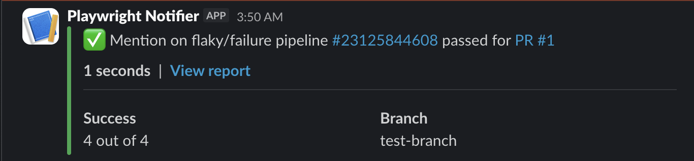
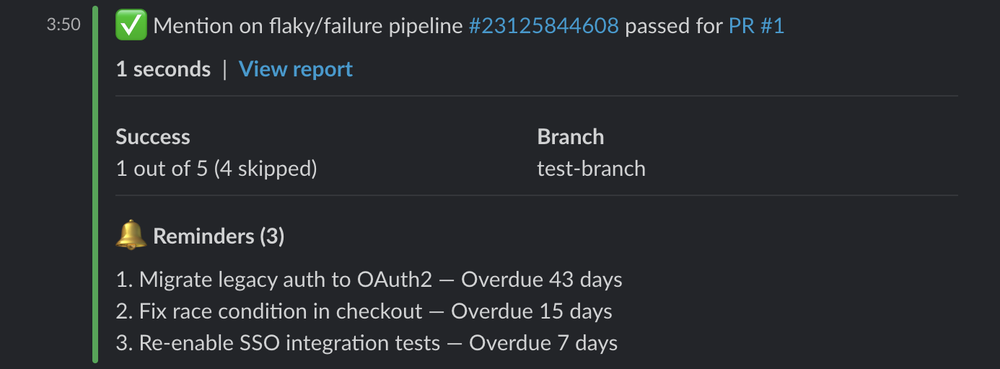
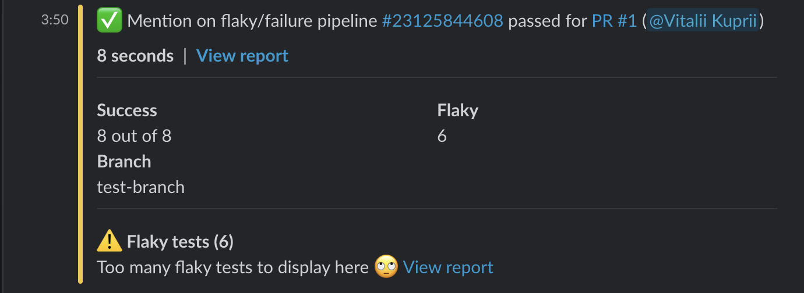
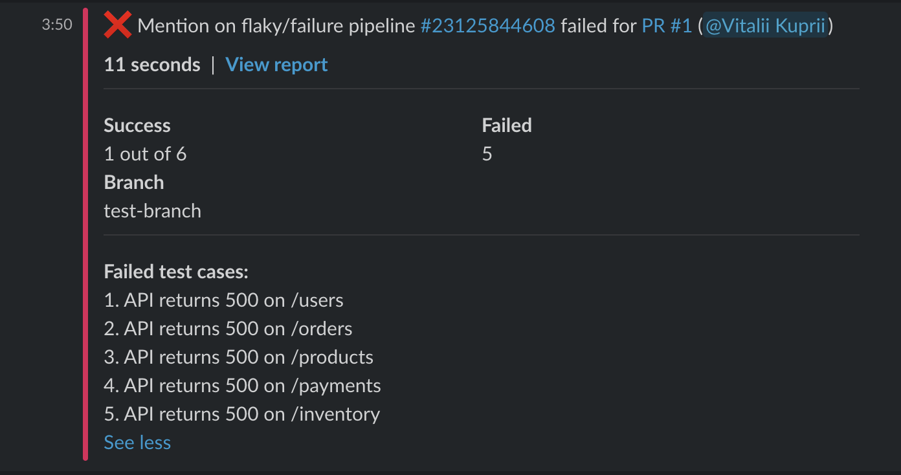
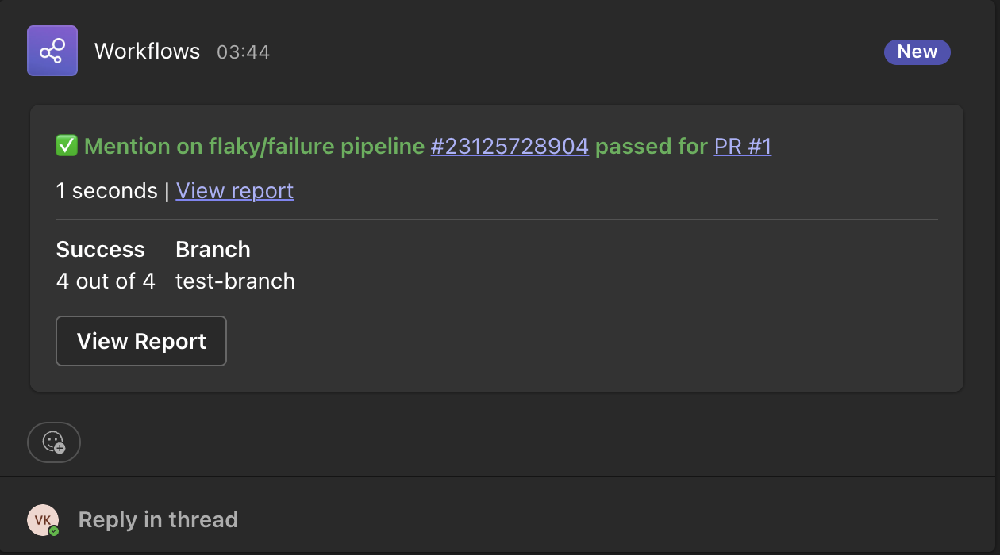
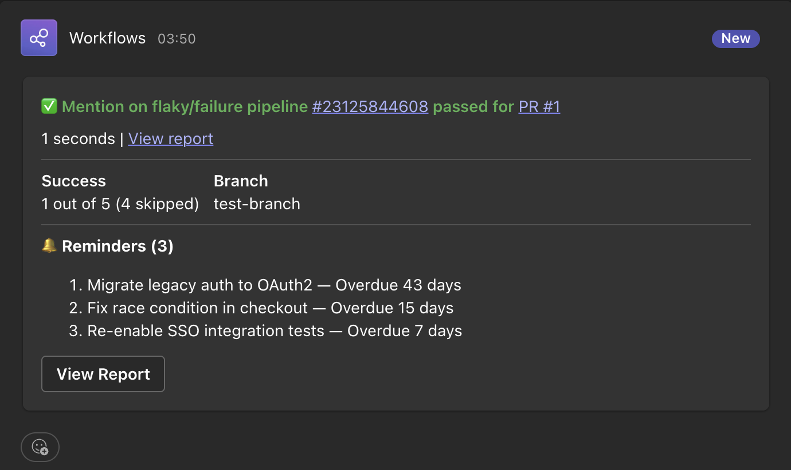
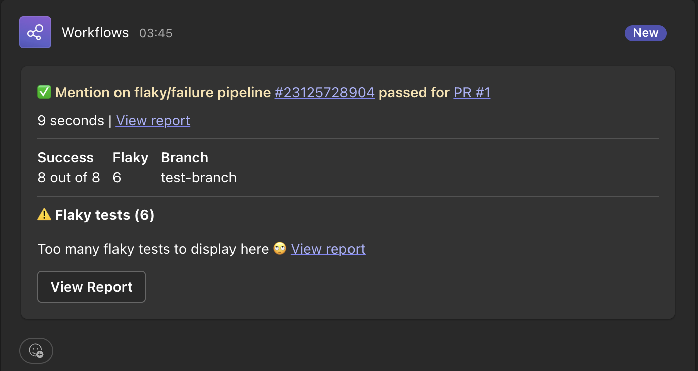
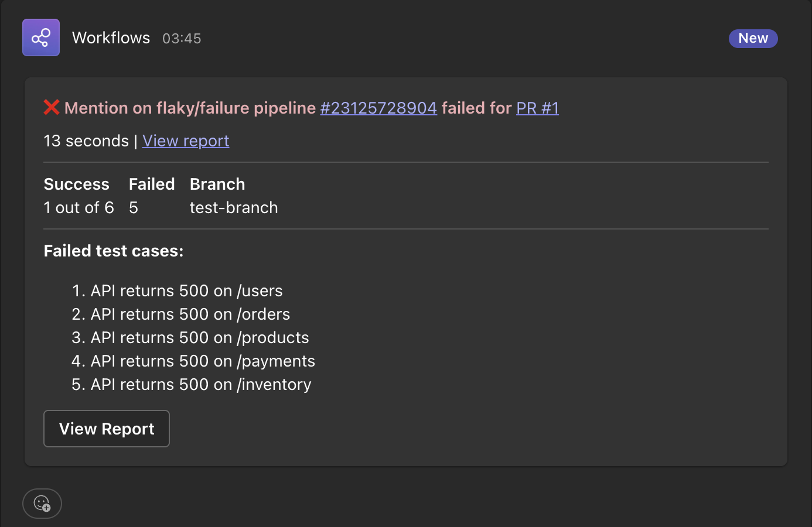

# playwright-notifier

Playwright reporter that sends test results to **Slack**, **Microsoft Teams**, **Email**, and **Webhook**.
Designed for CI pipelines — add it to your Playwright config and get instant notifications when tests pass, fail, or flake.

## Features

- **Multi-channel** — send to Slack, Teams and Email
- **CI auto-detection** — picks up branch, commit, actor, and run URL from GitHub Actions, GitLab CI, and Azure DevOps
- **Flaky test tracking** — highlights tests that passed only after retries
- **Skip reminders** — tag skipped tests with `@remind(YYYY-MM-DD)` and get notified when they're overdue
- **On-call rotation** — rotate who gets mentioned on failures (daily, weekly, or biweekly)
- **Environment detection** — auto-detects `staging`, `dev`, `production` from your base URL
- **Shard validation** — detects missing shards in merged reports and prevents misleading "Success" notifications
- **Configurable** — control what gets shown, how many failures to list, and who gets pinged

## Screenshots

### Slack

| Passed | Reminders |
|--------|-----------|
|  |  |

| Flaky | Failed |
|-------|--------|
|  |  |

### Teams

| Passed | Reminders |
|--------|-----------|
|  |  |

| Flaky | Failed |
|-------|--------|
|  |  |

## Install

```bash
npm install playwright-notifier --save-dev
```

## Quick Start

Add the reporter to your `playwright.config.ts`:

```ts
import { defineConfig } from '@playwright/test';

export default defineConfig({
  reporter: [
    ['list'],
    ['playwright-notifier', {
      channels: {
        slack: {
          webhookUrl: process.env.SLACK_WEBHOOK_URL,
        },
      },
    }],
  ],
});
```

That's it. Run your tests and you'll get a Slack notification.

---

## Configuration

All options are optional and have sensible defaults.

### Core Options

| Option | Type | Default | Description |
|--------|------|---------|-------------|
| `sendResults` | `'always'` \| `'on-failure'` \| `'off'` | `'always'` | When to send notifications |
| `sendOnInterrupted` | `boolean` | `false` | Send notifications when pipeline is cancelled/interrupted |
| `ciOnly` | `boolean` | `true` | Only send notifications in CI environments |
| `projectName` | `string` | — | Display name for the project |
| `environment` | `string` | `'default'` | Environment label (auto-detected from baseURL) |
| `branch` | `string` | — | Override branch name (auto-detected in CI) |
| `expectedShards` | `number` | — | Expected number of shards — detects missing shards in merged reports |
| `meta` | `{ key, value }[]` | `[]` | Extra key-value metadata to include |

### Display Options

Controls how test results are rendered in notifications.

```ts
display: {
  maxFailures: 5,       // Max failed/flaky tests to list before truncating
  maxErrorLength: 300,  // Max characters per error message
  reportUrl: 'https://your-report-url.com/run/123', // Link to the HTML report
}
```

| Option | Type | Default | Description |
|--------|------|---------|-------------|
| `display.maxFailures` | `number` | `5` | Max failed/flaky tests to list in the notification |
| `display.maxErrorLength` | `number` | `300` | Max characters per error message |
| `display.reportUrl` | `string` | — | Link to the HTML report |

### Flaky Test Config

Controls whether flaky tests (passed after retries) are highlighted in notifications.

```ts
flaky: {
  show: true,     // Include flaky tests section in the report
  mention: false, // Mention users when flaky tests are detected
}
```

| Option | Type | Default | Description |
|--------|------|---------|-------------|
| `flaky.show` | `boolean` | `false` | Include flaky tests in the report |
| `flaky.mention` | `boolean` | `false` | Mention users when flaky tests are detected |

### Reminders Config

Controls skip reminder alerts for tests tagged with `@remind(YYYY-MM-DD)`.

```ts
reminders: {
  show: true, // Show skip reminder alerts
}
```

| Option | Type | Default | Description |
|--------|------|---------|-------------|
| `reminders.show` | `boolean` | `true` | Show skip reminder alerts |

### Triggered By

Show who triggered the CI pipeline. Supports three formats:

**Simple boolean** — shows the raw CI actor name:
```ts
showTriggeredBy: true
```

**Structured format with user mapping** — maps CI usernames to channel-specific mentions:
```ts
showTriggeredBy: {
  users: {
    'alice': '<@U12345>',    // Slack user ID
    'bob':   '<@U67890>',
  },
  onFailure: true, // Only show triggeredBy on failed pipelines (avoids pinging on green runs)
}
```

When `onFailure: true`, the triggered-by field is only included when the pipeline status is `failed`. This is useful when `users` maps to Slack `<@U...>` IDs — it prevents pinging the person on every green pipeline.

When `onFailure: false` (default), triggered-by is always shown regardless of status.

| Option | Type | Default | Description |
|--------|------|---------|-------------|
| `showTriggeredBy` | `boolean` \| `{ users, onFailure }` | `false` | Show who triggered the pipeline |
| `showTriggeredBy.users` | `Record<string, string>` | — | Map CI usernames to display names/mentions |
| `showTriggeredBy.onFailure` | `boolean` | `false` | Only show on failed pipelines |

### Full Example

```ts
['playwright-notifier', {
  sendResults: 'always',
  sendOnInterrupted: false, // skip notifications when pipeline is cancelled
  ciOnly: true,
  projectName: 'My App E2E',
  environment: 'staging',
  expectedShards: 4, // warn if fewer than 4 shards report results

  display: {
    maxFailures: 5,
    maxErrorLength: 300,
    reportUrl: 'https://your-report-url.com',
  },

  flaky: {
    show: true,
    mention: false,
  },

  reminders: {
    show: true,
  },

  showTriggeredBy: {
    users: {
      'alice': '<@U12345>',
      'bob': '<@U67890>',
    },
    onFailure: true,
  },

  meta: [
    { key: 'Region', value: 'eu-west-1' },
  ],

  channels: { /* ... */ },
  rotation: { /* ... */ },
}]
```

### Backward Compatibility

The following flat config keys are deprecated but still work. They will be automatically migrated to the nested format with a console warning:

| Deprecated Key | Use Instead |
|---|---|
| `showFlaky` | `flaky: { show: true }` |
| `mentionOnFlaky` | `flaky: { mention: true }` |
| `showReminders` | `reminders: { show: true }` |
| `maxFailures` | `display: { maxFailures: 5 }` |
| `maxErrorLength` | `display: { maxErrorLength: 300 }` |
| `reportUrl` | `display: { reportUrl: '...' }` |
| `showTriggeredBy: { user: '<@U>' }` (flat mapping) | `showTriggeredBy: { users: { user: '<@U>' } }` |

---

## Channels

### Slack

Two modes: **Webhook** (simple, one channel) or **Bot Token** (multiple channels, thread support).

#### How to get a Slack Webhook URL

1. Go to [api.slack.com/apps](https://api.slack.com/apps) and create a new app (or select an existing one)
2. Navigate to **Incoming Webhooks** and activate them
3. Click **Add New Webhook to Workspace** and select the channel
4. Copy the webhook URL (starts with `https://hooks.slack.com/services/...`)

#### Webhook mode

```ts
channels: {
  slack: {
    webhookUrl: process.env.SLACK_WEBHOOK_URL,
    mentionOnFailure: ['<@U0123ABC>', '@qa-team'],
  },
}
```

#### How to get a Slack Bot Token

1. Go to [api.slack.com/apps](https://api.slack.com/apps) and create a new app
2. Navigate to **OAuth & Permissions**
3. Add the `chat:write` bot scope
4. Install the app to your workspace
5. Copy the **Bot User OAuth Token** (starts with `xoxb-...`)
6. Invite the bot to the channel(s) you want to post to: `/invite @your-bot`

#### Bot Token mode

Supports posting to multiple channels and reminder threads.

```ts
channels: {
  slack: {
    token: process.env.SLACK_BOT_TOKEN,
    channels: ['#qa-alerts', '#dev-notifications'],
    mentionOnFailure: ['<@U0123ABC>'],
    reminderPlacement: 'thread', // or 'inline' (default)
  },
}
```

**Finding Slack User IDs for mentions:** In Slack, click on a user's profile, then click the three dots (...) menu and select "Copy member ID". The format is `<@U0123ABC>`.

#### Slack Options

| Option | Type | Default | Description |
|--------|------|---------|-------------|
| `webhookUrl` | `string` | — | Slack Incoming Webhook URL |
| `token` | `string` | — | Slack Bot User OAuth Token (`xoxb-...`) |
| `channels` | `string[]` | `[]` | Channels to post to (bot mode only) |
| `mentionOnFailure` | `string[]` | `[]` | Users/groups to mention on failure (`<@U...>` format) |
| `reminderPlacement` | `'inline'` \| `'thread'` | `'inline'` | Where to show skip reminders (bot mode only) |
| `sendResults` | `'always'` \| `'on-failure'` \| `'off'` | — | Override global `sendResults` for this channel |

> **Note:** Either `webhookUrl` OR both `token` + `channels` are required.

---

### Microsoft Teams

Sends Adaptive Card messages to a Teams channel via webhook.

#### Webhook Types

Teams supports two webhook types with different capabilities:

| Feature | Standard Webhook | Power Automate Workflow |
|---------|-----------------|----------------------|
| Setup complexity | Simple | Moderate |
| @mentions in cards | **Not supported** | Supported |
| Adaptive Card support | Yes | Yes |
| Authentication | Webhook URL only | Workflow URL |

**Important:** Standard webhooks (Incoming Webhook connector) **cannot resolve @mentions** in Adaptive Cards. If you need `mentionOnFailure` or on-call rotation mentions to work in Teams, you must use a Power Automate workflow webhook.

#### How to set up a Standard Webhook (simple, no mentions)

1. In your Teams channel, click the three dots (...) menu and select **Connectors** (or **Manage channel** > **Connectors**)
2. Search for **Incoming Webhook** and click **Configure**
3. Name it (e.g., "E2E Test Results") and optionally upload an icon
4. Click **Create** and copy the webhook URL

```ts
channels: {
  teams: {
    webhookUrl: process.env.TEAMS_WEBHOOK_URL,
    // webhookType defaults to 'standard'
    // mentionOnFailure will be IGNORED for standard webhooks
  },
}
```

#### How to set up a Power Automate Webhook (supports @mentions)

1. Go to [flow.microsoft.com](https://flow.microsoft.com) (Power Automate)
2. Create a new **Instant flow** triggered by **When a HTTP request is received**
3. Add an action: **Post adaptive card in a chat or channel**
4. Configure the action to post to your desired Teams channel
5. Save the flow and copy the HTTP POST URL

```ts
channels: {
  teams: {
    webhookUrl: process.env.TEAMS_POWERAUTOMATE_URL,
    webhookType: 'powerautomate',
    mentionOnFailure: ['user@company.com'], // Works with Power Automate!
  },
}
```

#### Teams Options

| Option | Type | Default | Description |
|--------|------|---------|-------------|
| `webhookUrl` | `string` | **required** | Teams webhook URL |
| `webhookType` | `'standard'` \| `'powerautomate'` | `'standard'` | Webhook connector type |
| `mentionOnFailure` | `string[]` | `[]` | Users to mention on failure (**Power Automate only**) |
| `sendResults` | `'always'` \| `'on-failure'` \| `'off'` | — | Override global `sendResults` |

---

### Email

Sends HTML emails via SMTP. Requires the `nodemailer` package:

```bash
npm install nodemailer --save-dev
```

#### How to set up Email notifications

You need an SMTP server. Common options:
- **Gmail:** `smtp.gmail.com:587` (requires [App Password](https://support.google.com/accounts/answer/185833))
- **Outlook/Office 365:** `smtp.office365.com:587`
- **AWS SES:** Your SES SMTP endpoint
- **Self-hosted:** Your company's SMTP server

```ts
channels: {
  email: {
    to: ['team@company.com', 'qa@company.com'],
    from: 'ci@company.com', // Defaults to SMTP user if omitted
    subject: '[{{status}}] {{projectName}} — {{passed}}/{{total}} passed',
    smtp: {
      host: 'smtp.company.com',
      port: 587,
      secure: false,
      auth: {
        user: process.env.SMTP_USER,
        pass: process.env.SMTP_PASS,
      },
    },
  },
}
```

Subject supports template variables: `{{status}}`, `{{projectName}}`, `{{passed}}`, `{{failed}}`, `{{skipped}}`, `{{flaky}}`, `{{total}}`, `{{environment}}`.

#### Email Options

| Option | Type | Default | Description |
|--------|------|---------|-------------|
| `to` | `string[]` | **required** | Recipient email addresses |
| `from` | `string` | SMTP user | Sender email address |
| `subject` | `string` | `'[{{status}}] {{projectName}} — {{passed}}/{{total}} passed'` | Email subject template |
| `smtp` | `object` | **required** | SMTP connection config |
| `smtp.host` | `string` | **required** | SMTP server hostname |
| `smtp.port` | `number` | `587` | SMTP port |
| `smtp.secure` | `boolean` | `false` | Use TLS |
| `smtp.auth` | `{ user, pass }` | **required** | SMTP credentials |
| `sendResults` | `'always'` \| `'on-failure'` \| `'off'` | — | Override global `sendResults` |

---

### Webhook (Generic)

Sends the full `NormalizedSummary` JSON to any HTTP endpoint. Useful for custom integrations, dashboards, or services like Discord bots, PagerDuty, etc.

```ts
channels: {
  webhook: {
    url: 'https://your-api.com/test-results',
    headers: { Authorization: 'Bearer token123' },
    method: 'POST', // or 'PUT'
  },
}
```

| Option | Type | Default | Description |
|--------|------|---------|-------------|
| `url` | `string` | **required** | Webhook endpoint URL |
| `headers` | `Record<string, string>` | `{}` | Custom HTTP headers |
| `method` | `'POST'` \| `'PUT'` | `'POST'` | HTTP method |
| `sendResults` | `'always'` \| `'on-failure'` \| `'off'` | — | Override global `sendResults` |

---

## PR/MR Detection

Pull request and merge request context is auto-detected from CI environment variables. When a PR/MR is detected, the notification header changes format:

| Context | Header format |
|---------|--------------|
| Main branch | `Pipeline failed MyApp (alice)` |
| Pull request | `Pipeline MyApp failed for PR #42 (alice)` |

Supported CI providers:

- **GitHub Actions** — detects from `GITHUB_HEAD_REF` + `GITHUB_REF`
- **GitLab CI** — detects from `CI_MERGE_REQUEST_IID`
- **Azure DevOps** — detects from `BUILD_REASON`

## CI-Only Mode

By default, `ciOnly` is `true` — notifications are suppressed when running tests locally. The reporter detects CI via standard environment variables (`CI`, `GITHUB_ACTIONS`, `GITLAB_CI`, `TF_BUILD`).

Set `ciOnly: false` to send notifications from local runs as well.

## Interrupted & Timed Out Runs

Playwright's `onEnd` receives a run-level status that can be `passed`, `failed`, `interrupted`, or `timedout`. The reporter handles these correctly:

| Run Status | Default Behavior | Header Example |
|------------|-----------------|----------------|
| `passed` | Send notification | `✅ Pipeline #12345 passed for PR #42` |
| `failed` | Send notification | `❌ Pipeline #12345 failed for PR #42` |
| `interrupted` | **Skip notification** | `❌ Pipeline #12345 was cancelled for PR #42` |
| `timedout` | Send notification (as failure) | `❌ Pipeline #12345 timed out for PR #42` |

**Interrupted runs** (e.g. cancelled CI pipelines) are silently skipped by default — the results are incomplete and would be misleading. To receive notifications for cancelled runs, set `sendOnInterrupted: true`.

**Timed out runs** are always reported because they indicate a real problem (global timeout exceeded). The notification header shows "timed out" instead of "failed".

At the individual test level:
- Tests that were **interrupted** (running when pipeline was cancelled) are counted as **skipped**
- Tests that **timed out** are counted as **failed**

## Missing Shard Detection

When using [Playwright sharding](https://playwright.dev/docs/test-sharding) in CI, a shard can crash before running any tests (infra failure, OOM, etc.) and never upload a blob report. When `merge-reports` runs, it only sees reports from the shards that succeeded — so the reporter would send a misleading "Success" notification.

Set `expectedShards` to detect this:

```ts
['playwright-notifier', {
  expectedShards: 4,
  channels: {
    slack: { webhookUrl: '...' },
  },
}]
```

When the actual shard count in the merged report is lower than expected:
- The notification status is forced to **failed** (even if all reported tests passed)
- A warning line is appended: `Warning: only 3 of 4 shards reported — results are incomplete`
- `mentionOnFailure` and on-call rotation triggers as it would for any failure

When `expectedShards` is not set, behavior is unchanged (backwards compatible).

The actual shard count is detected from Playwright's merged report metadata — when `merge-reports` runs, each shard contributes separate project entries with the same name, so the reporter counts how many instances exist.

## Skip Reminders

Tag skipped tests with `@remind(YYYY-MM-DD)` to get notified when they're overdue:

```ts
test.skip('broken feature @remind(2025-06-01)', async ({ page }) => {
  // This test will trigger a reminder after June 1, 2025
});
```

When the date passes, the notification includes a reminder section showing overdue tests and how many days late they are. Tags are automatically stripped from display names — the notification shows clean test names.

- **Single reminder** — shown inline under the duration line
- **Multiple reminders** — shown as a numbered list at the bottom of the notification

## Test Ownership

Tag tests with `@owner(name)` to identify who is responsible:

```ts
test('checkout flow @owner(alice)', async ({ page }) => {
  // If this test fails, alice will be mentioned in the notification
});
```

Tags like `@owner(alice)` are stripped from display names. The notification shows `checkout flow (alice)` not `checkout flow @owner(alice)`.

When the owner name matches a member in the rotation config, their Slack/email info is used for mentions.

## On-Call Rotation

Automatically rotate who gets mentioned on failures:

```ts
rotation: {
  enabled: true,
  schedule: 'weekly',      // 'daily' | 'weekly' | 'biweekly'
  startDate: '2025-06-01', // rotation start date (YYYY-MM-DD)
  members: [
    { name: 'alice', slack: '<@U0123ABC>' },
    { name: 'bob',   slack: '<@U0456DEF>' },
    { name: 'charlie', slack: '<@U0789GHI>', email: 'charlie@company.com' },
  ],

  // Manual overrides for specific dates
  calendar: {
    '2025-06-15': 'charlie', // charlie covers this date regardless of schedule
  },

  // Show on-call person in the notification header
  mentionInSummary: true,
}
```

The rotation cycles through members based on the schedule. When rotation is active, the on-call person is mentioned instead of the `mentionOnFailure` list.

> **Teams note:** On-call mentions are only rendered for Power Automate webhooks. Standard webhooks cannot resolve @mentions — see [Teams section](#microsoft-teams) above.

## CI Auto-Detection

The reporter automatically detects CI context from environment variables:

| CI Provider | Branch | Commit | Run URL | Actor | Pipeline |
|-------------|--------|--------|---------|-------|----------|
| **GitHub Actions** | `GITHUB_REF_NAME` | `GITHUB_SHA` | Built from `GITHUB_REPOSITORY` + `GITHUB_RUN_ID` | `GITHUB_ACTOR` | `GITHUB_WORKFLOW` |
| **GitLab CI** | `CI_COMMIT_BRANCH` | `CI_COMMIT_SHA` | `CI_PIPELINE_URL` | `GITLAB_USER_LOGIN` | `CI_PROJECT_NAME` |
| **Azure DevOps** | `BUILD_SOURCEBRANCH` | `BUILD_SOURCEVERSION` | `BUILD_BUILDURI` | `BUILD_REQUESTEDFOR` | `BUILD_DEFINITIONNAME` |

Detected values are automatically added to the `meta` section unless you provide them manually.

## Environment Detection

When `environment` is set to `'default'` (the default), the reporter tries to detect it from your Playwright `baseURL`:

| URL pattern | Detected environment |
|-------------|---------------------|
| `localhost`, `127.0.0.1`, `0.0.0.0` | `local` |
| `dev.mysite.com` | `dev` |
| `staging.mysite.com`, `stg.mysite.com` | `staging` |
| `qa.mysite.com` | `qa` |
| `uat.mysite.com` | `uat` |
| `preprod.mysite.com` | `preprod` |
| `prod.mysite.com` | `production` |

You can always override this by setting `environment` explicitly.

## GitHub Actions Example

```yaml
name: E2E Tests
on: [push]

jobs:
  test:
    runs-on: ubuntu-latest
    steps:
      - uses: actions/checkout@v4
      - uses: actions/setup-node@v4
        with:
          node-version: 20
      - run: npm ci
      - run: npx playwright install --with-deps
      - run: npx playwright test
        env:
          SLACK_WEBHOOK_URL: ${{ secrets.SLACK_WEBHOOK_URL }}
```

## License

MIT
